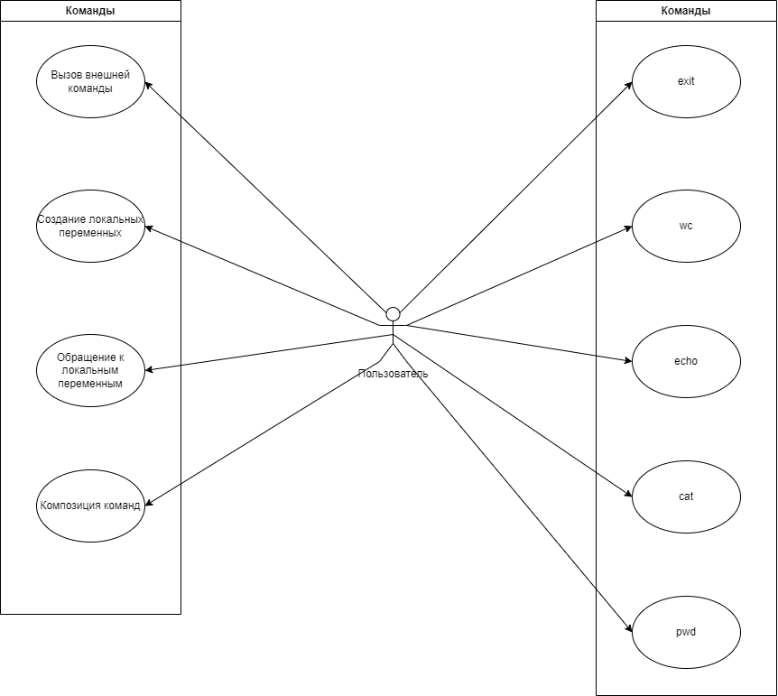

## Общий подход к решению

### Пользовательские сценарии



### Общее описание

Токен — подстрока входной строки, ограниченная пробелами с двух сторон.

Обработчик — автомат, который имитирует работу CLI в соответствии с требованиями, состоит из следующих частей:

1. ``Reader`` — модуль, который построчно обрабатывает входные строки, получаемые из терминала. Символом конца строки является символ "\n".
2. ``Parser`` — модуль, который на вход получает считанную ``Readerом`` строку и разбивает ее на команды с соответствующими параметрами (если это возможно). Предварительно выполняет подстановку.
3. ``Checker`` — модуль, отвечающий за проверку на валидность распарсенных команд и параметров.
4. ``Executor`` — модуль, отвечающий за последовательный запуск команд со считанными параметрами, полученными на этапе парсинга и проверки.

Разрабатываемая программа является однопоточной, выполнение команд — последовательное.

### Reader

Считывает из стандартного потока символы и конструирует строку из них, пока его не остановят в следствие выполненной команды exit.

#### Алгоритм работы Reader

1. Считывает из стандартного потока последовательности символов до тех пор, пока не встретит символ конца строки;
2. Формирует из считанной последовательности символов строку, которую передает на обработку ``Parser``;
3. Если ``Executor`` в конце передал сигнал, что последняя команда — exit, ``Reader`` завершает свою работу;
4. Иначе — переходит к п.1.

Если в стандартном потоке нет символов для считывания, находится в состоянии ожидания.

**Разделитель**: символ пробела.

### Parser

Состоит из двух частей:

1. ``Substitutor`` — ищет в полученной на вход строке все возможные подстановки и выполняет их. Если выполнить
   подстановку не получается — переменной нет в окружении — заменяет подстановку на пустую строку;
2. ``Command parser`` — модифицированную строку разбивает на команду/ы и параметры.

#### Алгоритм ``Substitutor``:

1. Поиск по подстроке мест, куда можно сделать подстановки. Как определяется место, куда можно сделать подстановку:

   1.1. Если обнаружена пара двойных неэкранированных кавычек, то они удаляются, а подстрока между ними обрабатывается на наличие подстановок.
   1.2. Если обнаружена пара одинарных кавычек, то они удаляются, подстрока между ними не обрабатывается на наличие подстановок, а передаётся в неизменном виде далее.
   1.3. При обнаружении символа ``$`` осуществляется поиск переменных в окружении и подстановка если нет каких-либо ограничений (одинарных кавычек).
2. Подстановка переменных из окружения, если это возможно. Если переменной нет в окружении — подставляем пустую строчку.
3. При инициализации переменной, происходит связывание имени со значением. Если для инициализации необходима подстановка, то она осуществляется сразу. В независимости от того, заключено значение переменной в кавычки или нет, будет присваиваться введенная
   информация до конца строки или до первого пайпа вместе с пробелами.

##### Замечания/уточнения

1. Так как подстановка осуществляется сразу и единожды (не имеется ввиду случай реинициализации переменной, тогда просто старое значение заменяется новым), а при не обнаружении переменной подставляется дефолтное значение, то воспроизвести рекурсивную подстановку невозможно.
2. Подстрока между двойными кавычками обрабатывается как обычный токен, то есть, если на вход была подана следующая команда: ``cat ""$y""``, то все двойные кавычки будут убраны, а вместо ``$y`` осуществлена подстановка.

#### Алгоритм ``Command Parser``:

1. Первый [токен](#общее-описание) строки -- название команды. Если команд несколько, то командой считается или первый токен строки, или первый
   токен после символа ``|`` (будет добавлено во второй фазе проекта);
2. Все следующие после названия команды токены, начинающиеся с символа ``-`` или ``--`` определяются как флаги команды (пробел между символом и самим флагом должен отсутствовать). Применимо только для стандартных команд, аргументы внешних команд такой обработке не поддаются и передаются в неизменном (не считая подстановки на предыдущем шаге) виде;
3. Все токены, следующие после последнего флага, определяются как параметры команды.

Результатом работы ``Command Parser`` является список информации о каждой распарсенной команде.

Информация предоставляется в виде некоторой структуры, которая содержит следующие поля:

1. Название команды;
2. Список флагов (может быть пустым);
3. Список параметров (может быть пустым).

### Checker

Сопоставляет полученный список с информацией о командах с реальными командами, предусмотренными разрабатываемой
программой.

#### Алгоритм ``Checker``

1. Проверить название команды со списком доступных команд. Если название есть в списке, переход к п.2, иначе — поиск
   в ``PATH``. Если в ``PATH`` такого названия команды нет, выдать ошибку. Возврат управления ``Readerу``. Если поиск в ``PATH`` успешен, то переход к п.4;
2. Если команда не из `PATH`, то проверить список флагов у текущей рассматриваемой команды. Если флаг верный, то переход к п.3, если какой-либо флаг
   не является валидным для данной команды, выдать ошибку и вернуть управление ``Readerу``. Валидирование флагов осуществляется посредством получения списка флагов от команды и проверки принадлежности к нему флага, полученного в результате парсинга;
3. Если команда не из `PATH`, то параметры этой команды проходят [базовые проверки](#базовые-проверки-для-команд), иначе — переход к п.4. Если все
   параметры валидны, то переход к п.4, если какой-то параметр не проходит проверку, то выдать ошибку и вернуть
   управление ``Readerу``;
4. Если еще есть непроверенные команды, переход к следующей в списке команде и к п.1, иначе — к п.5;
5. Передача проверенного списка команд ``Executorу``.

Ошибка неправильной команды: содержит информацию об имени соответствующей команды.

Ошибка неправильного флага: содержит информацию о том, что соответствующая команда не содержит такой флаг + информация о
существующих флагах для этой команды.

Ошибка неправильного параметра: содержит информацию о том, что соответствующей команде передали неправильный параметр +
информация о том, какой параметр ожидается.

##### Базовые проверки для команд


| Название команды | Проверки                                                                                                                                                                                                                                                                                                                                                                                                                                                                                                                                                                                                                                                                                                                                                                                                                                                                                                                                                                                                                                                                                                                                                                                                                                                                                                                                                                         |
| ------------------------------- | ---------------------------------------------------------------------------------------------------------------------------------------------------------------------------------------------------------------------------------------------------------------------------------------------------------------------------------------------------------------------------------------------------------------------------------------------------------------------------------------------------------------------------------------------------------------------------------------------------------------------------------------------------------------------------------------------------------------------------------------------------------------------------------------------------------------------------------------------------------------------------------------------------------------------------------------------------------------------------------------------------------------------------------------------------------------------------------------------------------------------------------------------------------------------------------------------------------------------------------------------------------------------------------------------------------------------------------------------------------------------------------------- |
| cat                             | 1. Параметров нет: поток для вывода: стандартный output;</br> 2. Параметр есть и это файл: проверить, что есть такой файл, осуществить вывод содержимого файла &nbsp; 2.1 Второй и последующие параметры -- файлы: вывод поочерёдно содержимого файлов без разделителей </br> 3. Параметр файл: вывод содержимого файла в консоль.<br/> 4. Параметр является флагом: осуществляется проверка принадлежности введённого параметра к флагам <br/> &nbsp; 4.1. Введённый параметр не принадлежит списку флагов: ошибка <br/> &nbsp; 4.2. Введённый параметр принадлежит списку флагов: корректируется вывод в соответствии с введённым флагом.                                                                                                                                                                                                                                                                       |
| wc                              | 0. Формат вывода:``число_слов число_строк число_байт [имя файла]`` <br/> 1. Параметров нет: считываем данные из стандартного потока ввода, пока не встречен ``EOF``, затем вывод информации, как указано в пункте 0; <br/> 2. Параметр есть и это файл: вывод информации о содержимом фала, как указано в пункте 0. <br/> &nbsp; 2.1. Второй и последующие параметры файлы: вывод информации о содержимом файлов, как указано в пункте 0, вывод просуммированной информации о файлах.<br/> 3. Параметр есть и является флагом: осуществляется проверка принадлежности введённого параметра к флагам <br/> &nbsp; 3.1. Введённый параметр не принадлежит списку флагов: ошибка <br/> &nbsp; 3.2. Введённый параметр принадлежит списку флагов: корректируется вывод в соответствии с введённым флагом. |
| pwd                             | 1. Параметров нет: вывод пути к текущей папке;<br/> 2. Параметр есть и является флагом: осуществляется проверка принадлежности введённого параметра к флагам <br/> &nbsp; 2.1. Введённый параметр не принадлежит списку флагов: ошибка <br/> &nbsp; 2.2. Введённый параметр принадлежит списку флагов: корректируется вывод в соответствии с введённым флагом.                                                                                                                                                                                                                                                                                                                                                                                                                                                                                                                                                                                                                                                                                                                                                       |
| exit                            | Нет проверок.                                                                                                                                                                                                                                                                                                                                                                                                                                                                                                                                                                                                                                                                                                                                                                                                                                                                                                                                                                                                                                                                                                                                                                                                                                                                                                                                                                 |
| external commands               | Нет проверок.                                                                                                                                                                                                                                                                                                                                                                                                                                                                                                                                                                                                                                                                                                                                                                                                                                                                                                                                                                                                                                                                                                                                                                                                                                                                                                                                                                 |

### Executor

Последовательно выполняет все команды из списка команд, пока не достигнет конца списка. После этого возвращает управление ``Readerу``. Результат выполнения команды будет предоставлен следующей команде вместо стандартного потока ввода, если команда ничего не возвращает, то результат — пустая строка. Результаты выполнения предыдущих команд заменяются результатом выполнения текущей.

Если результат выполнения последней команды из списка присутствует, то он выводится в стандартный поток вывода.

1. Если список команд пустой, передать управление ``Readerу``, иначе — перейти к пункту 2;
2. Выполнить первую команду в очереди, передав ей список необходимых параметров (может быть пуст), если результат успешный (т.е., выполнение команды не было прервано исключением) — запомнить его и перейти к пункту 1, иначе — передать управление ``Readerу`` (откат команд не производится, если были внесены какие-либо изменения в файлы — они останутся, если результат команд хранился в памяти для последующей передачи другим командам, то он будет потерян).

### Блок-схема работы


### Диаграмма компонентов


## Краевые случаи

1. **Проблема**: Получение после подстановки валидных команд:

```shell
x=ex
y=it
$x$y
```

**Решение**: в считанной строке сначала производим все подстановки, если это возможно (если мы можем это сделать), и
только затем — парсинг на команды

2. **Проблема**: Подстановка переменной, которой нет в окружении.

   **Решение**: Подставляем пустую строку вместо отсутствующей переменной.
3. **Проблема**: Рекурсивная подстановка

   **Решение**: Подмена несуществующих переменных для невозможности воспроизведения рекурсивной подстановки, отсутствие повторной проверки на подстановку там, где она уже была осуществлена.
4. **Проблема**: Лишние проблемы между токенами и/или в начале/конце строки.

   **Решение**: ``Command Parser`` игнорирует пробелы в начале строки и в конце строки, если между токенами встречается
   более одного пробела, они так же игнорируются и не включаются в часть команды/параметра.
5. **Проблема**: Поведение двойных кавычек в различных командах

   **Решение**:

   5.1. Вместо переменных подставляются значения;

   5.2. В командах ``cat``, ``wc``, ``echo`` игнорируются
6. **Проблема**: Поведение одинарных кавычек в различных командах

   **Решение**:

   6.1. Знак ``$`` игнорируется — т.е., подстановка не осуществляется, сами кавычки удаляются;
7. **Проблема**: Передача параметров в команды, которые этого не ожидают

   **Решение**: Игнорирование переданных параметров

## Определение классов

### Команды

Каждая команда определена в соответствующем классе, который обрабатывает различные случаи.

#### cat

Класс, отвечающий за работу с файлами.

Поддерживаемые флаги:

1. ``--h``, ``--help`` — справка;
2. ``-e``, ``-E`` — добавление символа ``$`` в конце каждой строки;
3. ``-n`` — добавление номера строки вначале каждой строчки.

Алгоритм работы:

1. Если список параметров пуст, осуществлять чтение из стандартного потока (для второй части задания — либо из стандартного потока, либо берёт результат выполнения предыдущей команды), пока не встречен ``EOF``, вывести результат ввода, иначе — перейти к следующему пункту алгоритма;
2. Если первый переданный параметр файл осуществить поиск. Если файл не найден — вывести ошибку, иначе — вывести содержание файла.

#### wc

Класс, отвечающий за вывод информации о количестве слов, строк и байт переданных данных.

Поддерживаемые флаги:

1. ``--h``, ``--help`` — справка;
2. ``-c``, ``--c`` — вывод только количества байт данных;
3. ``-l``, ``--l`` — вывод только количества строк;
4. ``-w``, ``--w`` — вывод только количества слов;
5. ``-L``— вывод длины самой большей строки.

Алгоритм работы:

1. Если список параметров пуст — осуществить чтение данных со стандартного потока ввода (для второй части задания — либо из стандартного потока, либо берёт результат выполнения предыдущей команды), перейти к пункту 3;
2. Если переданный параметр — несуществующий файл: вывести ошибку, иначе — перейти к следующему пункту;
3. Произвести расчёт информации по переданным данным;
4. Если на вход было подано несколько файлов/данных для подсчета, то осуществить суммирование для итогового результата.

#### pwd

Класс, отвечающий за вывод информации о пути к текущей папке.

Поддерживаемые флаги:

1. ``--help`` — справка;

Игнорирует всю переданную информацию.

#### echo

Класс, отвечающий за вывод в консоль.

Не поддерживает флаги.

Если переданная для вывода информация содержит неэкранированные одинарные или двойные кавычки, то они удаляются перед выводом.

#### exit

Класс, отвечающий за окончание работы программы.

Не поддерживает флаги, игнорирует всю переданную информацию.

#### external commands

Внешние команды вызываются честно в консоли в зависимости от платформы — Linux или Windows, параметры для внешней команды проходят такую жу предобработку, как и параметры других команд, за исключением разделения на параметры и флаги. При вызове осуществляется синхронизация потоков ввода и вывода вызываемой команды с потоками ввода и вывода приложения. 

Буфер накапливает результат выполнения работы внешней команды, который потом будет помещён в файл (для второй части проекта).

После запуска внешней команды осуществляется ожидание завершения с отловом кода завершения. 

Если программа завершилась с кодом, отличным от нуля, то осуществляется получение информации об ошибке и её последующий вывод.
При этом падание внешней команды не влечёт падения приложения.

### Local storage

Класс, отвечающий за работу с переменными окружения. 

Хранит в себе переменные окружения, осуществляет поиск по ним по запросу. В случае, если переменная не найдена, возвращает пустую строку.
