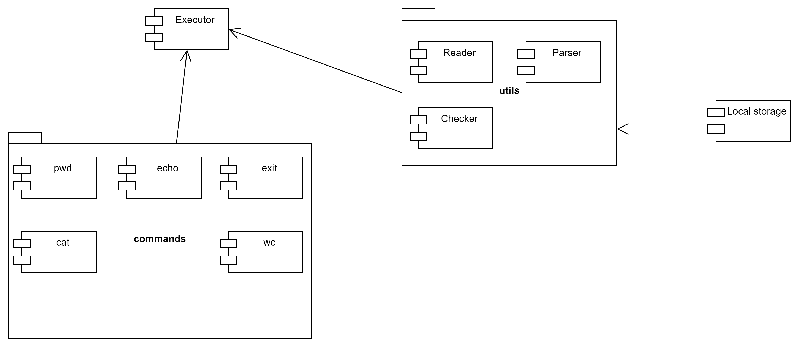

## Общий подход к решению

### Пользовательские сценарии


### Общее описание

Токен -- подстрока входной строки, ограниченная пробелами с двух сторон.

Обработчик -- автомат, который имитирует работу CLI в соответствии с требованиями, состоит из следующих частей:

1. ``Reader`` -- модуль, который построчно обрабатывает входные строки, получаемые из терминала. Символом конца строки *
   *является символ "\n"**.
2. ``Parser`` -- модуль, который на вход получает считанную Readerом строку и разбивает ее на команды с соответствующими
   параметрами (если это возможно). Предварительно выполняет подстановку.
3. ``Checker`` -- модуль, отвечающий за проверку на валидность распарсенных команд и параметров.
4. ``Executor`` -- модуль, отвечающий за последовательный запуск команд со считанными параметрами, полученными на этапе
   парсинга и проверки.

Разрабатываемая программа является однопоточной, выполнение команд -- последовательное.

### Reader

Считывает из стандартного потока символы и конструирует строку из них, пока не будет введена команда exit.

#### Алгоритм работы Reader

1. Считывает из стандартного потока последовательности символов до тех пор, пока не встретит символ конца строки;
2. Формирует из считанной последовательности символов строку, которую передает на обработку ``Parser``;
3. Если ``Executor`` в конце передал сигнал, что последняя команда -- exit, ``Reader`` завершает свою работу;
4. Иначе -- переходит к п.1.

Если в стандартном потоке нет символов для считывания, находится в состоянии ожидания.

**Разделитель**: символ пробела.

### Parser

Состоит из двух частей:

1. ``Substitutor`` -- ищет в полученной на вход строке все возможные подстановки и выполняет их. Если выполнить
   подстановку не получается -- переменной нет в окружении -- заменяет подстановку на пустую строку;
2. ``Command parser`` -- модифицированную строку разбивает на команду/ы и параметры.

#### Алгоритм ``Substitutor``:

1. Поиск по подстроке мест, куда можно сделать подстановки
2. Подстановка переменных из окружения, если это возможно. Если переменной нет в окружении -- подставляем пустую строчку.

#### Алгоритм ``Command Parser``:

1. Первый токен строки -- название команды. Если команд несколько, то командой считается или первый строки, или первый
   токен после символа ``|`` (будет добавлено во второй фазе проекта);
2. Все следующие после названия команды токены, начинающиеся с символа ``-`` или ``--`` определяются как флаги команды (пробел между символом и самим флагом должен отсутствовать);
3. Все токены, следующие после последнего флага, определяются как параметры команды.

Результатом работы ``Command Parser`` является список информации о каждой распарсенной команде.

Информация предоставляется в виде некоторой структуры, которая содержит следующие поля:

1. Название команды;
2. Список флагов (может быть пустым);
3. Список параметров (может быть пустым).

### Checker

Сопоставляет полученный список с информацией о командах с реальными командами, предусмотренными разрабатываемой
программой.

#### Алгоритм ``Checker``

1. Проверить название команды со списком доступных команд. Если название есть в списке, переход к п.2, иначе -- поиск
   в ``PATH``. Если в ``PATH`` такого названия команды нет, выдать ошибку. Возврат управления ``Reader``у. Если поиск в ``PATH`` успешен, то осуществляется запуск в оболочке;
2. Проверить список флагов у текущей рассматриваемой команды. Если флаг верный, то переход к п.3, если какой-либо флаг
   не является валидным для данной команды, выдать ошибку и вернуть управление ``Reader``у;
3. Если команда не из `PATH`, то параметры этой команды проходят базовые проверки, иначе -- переход к п.4. Если все
   параметры валидны, то переход к п.4, если какой-то параметр не проходит проверку, то выдать ошибку и вернуть
   управление ``Reader`у;
4. Если еще есть непроверенные команды, переход к следующей в списке команде и к п.1, иначе -- к п.5;
5. Передача проверенного списка команд ``Executor``у.

Ошибка неправильной команды: содержит информацию об имени соответствующей команды.

Ошибка неправильного флага: содержит информацию о том, что соответствующая команда не содержит такой флаг + информация о
существующих флагах для этой команды.

Ошибка неправильного параметра: содержит информацию о том, что соответствующей команде передали неправильный параметр +
информация о том, какой параметр ожидается.


| Название команды | Проверки                                                                                                                                                                                                                                                                                                                                                                                                                                                                                                                                                                                                                                                                                                                                                                                                                                                                                                                                                                                                                                                                                                                        |
| ------------------------------- |---------------------------------------------------------------------------------------------------------------------------------------------------------------------------------------------------------------------------------------------------------------------------------------------------------------------------------------------------------------------------------------------------------------------------------------------------------------------------------------------------------------------------------------------------------------------------------------------------------------------------------------------------------------------------------------------------------------------------------------------------------------------------------------------------------------------------------------------------------------------------------------------------------------------------------------------------------------------------------------------------------------------------------------------------------------------------------------------------------------------------------|
| cat                             | 1. Параметров нет: поток для вывода: стандартный output;</br> 2. Параметр есть и это файл: проверить, что есть такой файлб осуществить вывод содержимого файла &nbsp; 2.1 Второй и последующие параметры -- файлы: вывод поочерёдно содержимого файлов без разделителей </br> 3. Параметр знак ``>`` или ``>>``: </br> &nbsp; 3.1. Параметров перед этим нет: запись в файл пока не будет встречено сочетание клавишь ``Ctrl + D`` <br/> &nbsp; 3.2. Первый параметр есть (не флаг): запись в файл результата выполнения до знака <br/> &nbsp; 3.3. Второй параметр есть: создание файла под именем=второй параметр, запись в файл пока не будет встречено сочетание клавишь ``Ctrl + D`` <br/> &nbsp; 3.4. Второго параметра нет: ошибка. **Второй параметр обязателен.** <br/> 4. Параметр файл: вывод содержимого файла в консоль.<br/> 5. Параметр является флагом: осуществляется проверка принадлежности введённого параметра к флагам <br/> &nbsp; 5.1. Введённый параметр не принадлежит списку флагов: ошибка <br/> &nbsp; 5.2. Введённый параметр принадлежит списку флагов: корректируется вывод в соответствии с введённым флагом. |
| wc                              | 0. Формат вывода:``число_слов число_строк число_байт [имя файла]`` <br/> 1. Параметров нет: считываем данные из стандартного потока ввода, пока не встречено  сочетание клавишь ``Ctrl + D``, затем вывод информации, как указано в пункте 0; <br/> 2. Параметр есть и это файл: вывод информации о содержимом фала, как указано в пункте 0. <br/> &nbsp; 2.1. Второй и последующие параметры файлы: вывод информации о содержимом файлов, как указано в пункте 0, вывод просуммированной информации о файлах.<br/> 3. Параметр есть и является флагом: осуществляется проверка принадлежности введённого параметра к флагам <br/> &nbsp; 3.1. Введённый параметр не принадлежит списку флагов: ошибка <br/> &nbsp; 3.2. Введённый параметр принадлежит списку флагов: корректируется вывод в соответствии с введённым флагом.                                                                                                                                                                                                                                                                                                        |
| pwd                             | 1. Параметров нет: вывод пути к текущей папке;<br/> 2. Параметр есть и является флагом: осуществляется проверка принадлежности введённого параметра к флагам <br/> &nbsp; 2.1. Введённый параметр не принадлежит списку флагов: ошибка <br/> &nbsp; 2.2. Введённый параметр принадлежит списку флагов: корректируется вывод в соответствии с введённым флагом.                                                                                                                                                                                                                                                                                                                                                                                                                                                                                                                                                                                                                                                                                                                                                                  |
| exit                            | Команда без параметров, осуществляет закрытие программы. Если передаются какие-либо параметры, то они игнорируются                                                                                                                                                                                                                                                                                                                                                                                                                                                                                                                                                                                                                                                                                                                                                                                                                                                                                                                                                                                                              |

### Executor

Последовательно выполняет все команды из списка команд, пока не достигнет конца списка. После этого возвращает управление ``Reader``у. Результат выполнения команды (если она что-то возвращает) передается как последний параметр следующей команде из списка.

Если результат выполнения последней команды из списка присутствует, то он выводится в стандартный поток вывода.

1. Если список команд пустой, передать управление ``Reader``у, иначе -- перейти к пункту 2;
2. Выполнить первую команду в очереди, передав ей список необходимых параметров (может быть пуст), если результат успешный -- запомнить его и перейти к пункту 1, иначе -- передать управление ``Reader``у.

```Если какая-то команда из списка завершается неудачей, результат выполнения предыдущих команд не откатывается, управление возвращается ``Reader``у, выполнение всех последующих команд из списка прерывается```

### Блок-схема работы


### Диаграмма компонентов



[//]: #
## Краевые случаи

1. **Проблема**: Получение после подстановки валидных команд:

```shell
x=ex
y=it
$x$y
```

**Решение**: в считанной строке сначала производим все подставления, если это возможно (если мы можем это сделать), и
только затем -- парсинг на команды

2. **Проблема**: Подстановка переменной, которой нет в окружении.

   **Решение**: Подставляем пустую строку вместо отсутствующей переменной.
3. **Проблема**: Рекурсивная подстановка

   **Решение**: Синтаксическое ограничение для невозможности воспроизведения рекурсивной подстановки.
4. **Проблема**: Лишние проблемы между токенами и/или в начале/конце строки.

   **Решение**: ``Command Parser`` игнорирует пробелы в начале строки и в конце строки, если между токенами встречается
   более одного пробела, они так же игнорируются и не включаются в часть команды/параметра.
5. **Проблема**: Поведение двойных кавычек в различных командах

   **Решение**:
   5.1. Вместо переменных подставляются значения;
   5.2. В командах ``cat``, ``wc``, ``echo`` игнорируются
6. **Проблема**: Поведение одинарных кавычек в различных командах

   **Решение**:
   6.1. Знак ``$`` игнорируется -- т.е., подстановка не осуществляется;
   6.2. В командах ``cat``, ``wc``, ``echo`` игнорируются
7. **Проблема**: Передача параметров в команды, которые этого не ожидают

   **Решение**: Игнорирование переданных параметров


## Определение классов

### Команды

Каждая команда определена в соответствующем классе, который обрабатывает различные случаи.

#### cat

Класс, отвечающий за работу с файлами.

Поддерживаемые флаги:

1. ``--h``, ``--help`` -- справка;
2. ``-e``, ``-E`` -- добавление символа ``$`` в конце каждой строки
3. ``-n`` -- добавление номера строки вначале каждой строчки

Алгоритм работы:

1. Если список параметров пуст, осуществлять чтение из стандартного потока, пока не нажато сочетание клавиш ``Ctrl + D``, вывести результат ввода и передать управление ``Reader``у, иначе -- перейти к следующему пункту алгоритма.
2. Если список параметров пуст -- передать управление ``Reader``у, вернув в качестве ответа переменную для дальнейшего вывода/использования, иначе -- продолжать пошаговое выполнение алгоритма.
3. Если первый переданный параметр файл -- осуществить поиск. Если файл не найден -- вывести ошибку и передать управление ``Reader``у, иначе -- добавить к переменной содержание файла и перейти к пункту 2.
4. Если переданный параметр -- символ ``>``:

   4.1. Если нет следующего параметра, -- имени файла, -- то вывести ошибку и передать управление ``Reader``у.

   4.2. Если есть следующий параметр и переменная не пустая -- помещаем значение переменной в файл.

   4.2.1. Если файл не существовал -- создаём новый

   4.2.2. Если файл существовал -- перезаписываем

   4.3. Если есть следующий параметр и переменная пустая -- считываем данные со стандартного потока, пока не будет нажато сочетание клавиш ``Ctrl + D``.

   4.3.1. Если файл не существовал -- создаём новый

   4.3.2. Если файл существовал -- перезаписываем

   4.4. Передать управление ``Reader``у.

5. Если переданный параметр -- символ ``>>``:

   5.1. Если нет следующего параметра, -- имени файла, -- то вывести ошибку и передать управление ``Reader``у.

   5.2. Если есть следующий параметр и переменная не пустая -- помещаем значение переменной в конец файла.

   5.2.1. Если файл не существовал -- создаём новый

   5.2.2. Если файл существовал -- записываем в конец файла данные

   5.3. Если есть следующий параметр и переменная пустая -- считываем данные со стандартного потока, пока не будет нажато сочетание клавиш ``Ctrl + D``.

   5.3.1. Если файл не существовал -- создаём новый

   5.3.2. Если файл существовал -- записываем в конец файла данные

   5.4. Передать управление ``Reader``у.

``Поддерживается ввод только в один файл, то есть, синтакциси "cat > fst.txt > snd.txt" не поддерживается.``

#### wc

Класс, отвечающий за вывод информации о количестве слов, строк и байт переданных данных.

Поддерживаемые флаги:

1. ``--h``, ``--help`` -- справка;
2. ``-c``, ``--c`` -- вывод только количества байт данных
3. ``-l``, ``--l`` -- вывод только количества строк
4. ``-w``, ``--w`` -- вывод только количества слов
5. ``-L`` -- вывод длины самой большей строки

Алгоритм работы:

1. Если список параметров пуст -- осуществить чтение данных со стандартного потока ввода, перейти к пункту 4.
2. Если список параметров пуст, перейти к пункту 5, иначе -- перейти к следующему шагу.
3. Если переданный параметр -- несуществующий файл: вывести ошибку и перейти к пункту 2, иначе -- перейти к следующему пункту.
4. Произвести расчёт информации по считанным данным, поместить его в переменную и перейти к пункту 2.
5. Если переменная содержит несколько результатов (т.е., на вход было подано несколько файлов), то осуществить суммирование для итогового результата и также поместить в переменную. Перейти к следующему пункту.
6. Ввернуть информацию, передать управление ``Reader``у.

#### pwd

Класс, отвечающий за вывод информации о пути к текущей папке.

Поддерживаемые флаги:

1. ``--help`` -- справка;

Игнорирует всю переданную информацию.

#### echo

Класс, отвечающий за вывод в консоль.

Не поддерживает флаги.

Если переданная для вывода информация содержит неэкранированные одинарные или двойные кавычки, то они удаляются перед выводом.

#### exit

Класс, отвечающий за окончание работы программы.

Не поддерживает флаги, игнорирует всю переданную информацию.

### Local storage

Класс, отвечающий за работу с переменными окружения. 

Хранит в себе переменные окружения, осуществляет поиск по ним по запросу. В случае, если переменная не найдена, возвращает пустую строку.
